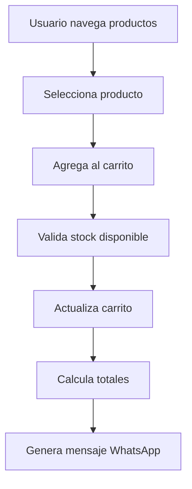
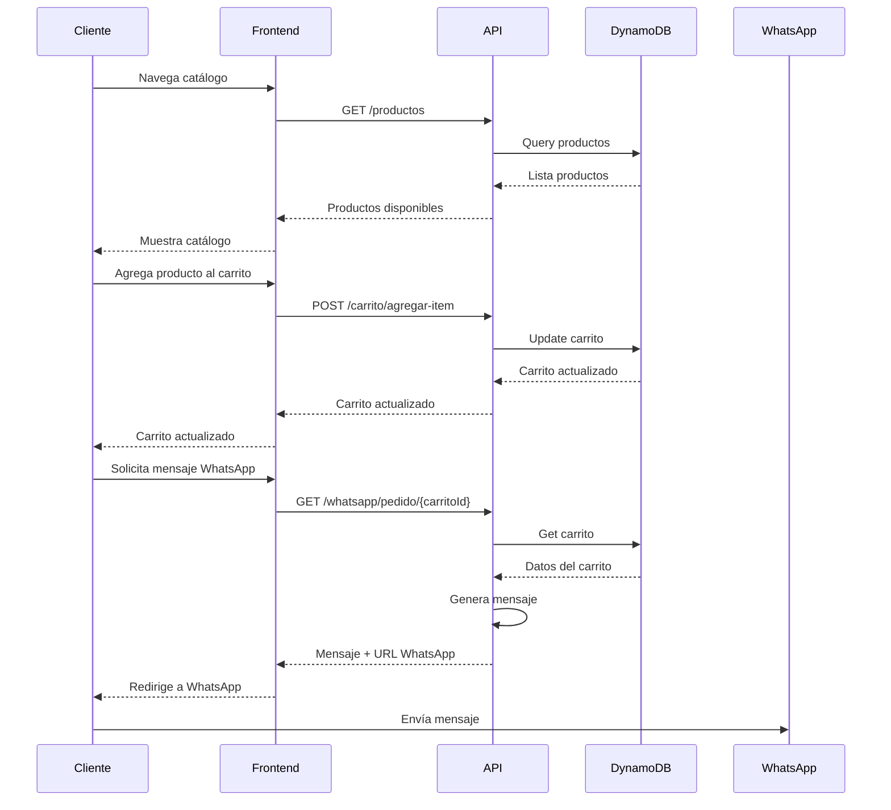

# 🛒 Dashboard Module - E-Commerce Warehouse Solutions

## 📋 Descripción General

El módulo **Dashboard** es el núcleo del sistema de e-commerce para **Warehouse Solutions**, una empresa especializada en la importación y venta de insumos para warehousing y logística. Este módulo implementa una arquitectura hexagonal (Clean Architecture) que permite gestionar productos, carritos de compras e integración con WhatsApp.

## 🎯 Objetivo Principal

Proporcionar una **plataforma web tipo catálogo/vidriera online** donde los clientes puedan:

- Navegar y consultar productos de warehousing y logística
- Agregar productos al carrito (sin necesidad de crear cuenta)
- Generar mensajes de pedido que se envíen directamente por WhatsApp
- Realizar consultas específicas sobre productos

## 🏗️ Arquitectura

```
dashboard/
├── src/
│   ├── application/          # Capa de Aplicación
│   │   ├── dtos/            # Data Transfer Objects
│   │   ├── exceptions/       # Excepciones de negocio
│   │   ├── factories/        # Factories para crear entidades
│   │   ├── mappers/          # Mappers entre capas
│   │   └── services/         # Servicios de aplicación
│   ├── domain/              # Capa de Dominio
│   │   ├── entities/         # Entidades de negocio
│   │   └── enums/           # Enumeraciones
│   └── infrastructure/       # Capa de Infraestructura
│       ├── adapters/         # Adaptadores (DynamoDB, WhatsApp)
│       ├── controllers/      # Controladores HTTP
│       └── ports/           # Interfaces (Puertos)
├── exports/                 # Handlers de Lambda
└── README.md
```

## 🚀 Funcionalidades Principales

### 📦 **Gestión de Productos**

#### Entidades

- **Producto**: Entidad principal que representa un producto del catálogo
- **Categorías**: 12 categorías especializadas en warehousing
- **Estados**: Disponible, Agotado, Descontinuado

#### Características

- ✅ **CRUD completo** de productos
- ✅ **Categorización** por tipo de equipo
- ✅ **Gestión de stock** con alertas de stock mínimo
- ✅ **Productos destacados** para promociones
- ✅ **Búsqueda** por nombre y descripción
- ✅ **Soft delete** para mantener historial
- ✅ **Especificaciones técnicas** detalladas
- ✅ **Gestión de imágenes y videos**
- ✅ **Información de envío** (peso, dimensiones, fragilidad)

#### Categorías Disponibles

```typescript
enum CategoriaProductoEnum {
  LECTORES_RFID = "Lectores RFID",
  SCANNERS = "Scanners",
  RACKS_METALICOS = "Racks Metálicos",
  ZORRAS = "Zorras",
  AUTOELEVADORES = "Autoelevadores",
  STRETCHADORAS = "Stretchadoras",
  BANDAS_TRANSPORTADORAS = "Bandas Transportadoras",
  SISTEMAS_ALMACENAMIENTO = "Sistemas de Almacenamiento",
  EQUIPOS_LOGISTICA = "Equipos de Logística",
  HERRAMIENTAS_WAREHOUSE = "Herramientas de Warehouse",
  SEGURIDAD_INDUSTRIAL = "Seguridad Industrial",
  EMBALAJE = "Embalaje",
}
```

### 🛒 **Sistema de Carrito de Compras**

#### Entidades

- **Carrito**: Contenedor de productos seleccionados
- **ItemCarrito**: Producto individual en el carrito con cantidad

#### Características

- ✅ **Creación automática** de carritos por sesión de usuario
- ✅ **Gestión de items** (agregar, actualizar, eliminar)
- ✅ **Cálculo automático** de totales y subtotales
- ✅ **Validación de stock** antes de agregar items
- ✅ **Persistencia** en DynamoDB
- ✅ **Limpieza** de carritos
- ✅ **Formateo de precios** para display

#### Flujo de Carrito



### 📱 **Integración WhatsApp**

#### Funcionalidades

- ✅ **Generación automática** de mensajes de pedido
- ✅ **Formato profesional** con detalles del carrito
- ✅ **URLs directas** a WhatsApp Web/App
- ✅ **Consultas específicas** por producto
- ✅ **Configuración flexible** de número y empresa
- ✅ **API opcional** para envío automático

#### Ejemplo de Mensaje Generado

```
Hola! Me interesa hacer un pedido de Warehouse Solutions:

1. Lector RFID Zebra MC9300 x 2 unidades
   Especificaciones: marca: Zebra, modelo: MC9300
   Precio unitario: $25,000.00
   Subtotal: $50,000.00

2. Rack Metálico Industrial x 1 unidad
   Precio unitario: $45,000.00
   Subtotal: $45,000.00

💰 Total estimado: $95,000.00

📋 Detalles del pedido:
• Total de productos: 2
• Cantidad total de unidades: 3

Por favor, confírmame:
• Disponibilidad de los productos
• Tiempo de entrega estimado
• Forma de pago y envío

¡Gracias! 🙏
```

## 🔧 **Tecnologías y Patrones**

### **Arquitectura Hexagonal (Clean Architecture)**

- **Domain**: Entidades puras de negocio
- **Application**: Casos de uso y servicios
- **Infrastructure**: Adaptadores y controladores

### **Tecnologías**

- **TypeScript** - Lenguaje principal
- **AWS Lambda** - Serverless functions
- **DynamoDB** - Base de datos NoSQL
- **AWS SDK v3** - Integración con servicios AWS
- **@hex-lib/core** - Framework hexagonal
- **class-validator** - Validación de DTOs

### **Patrones Implementados**

- **Repository Pattern** - Abstracción de persistencia
- **Factory Pattern** - Creación de entidades
- **Mapper Pattern** - Transformación entre capas
- **DTO Pattern** - Transferencia de datos
- **Dependency Injection** - Inyección de dependencias

## 📊 **Estructura de Datos**

### **Producto**

```typescript
interface Producto {
  id: UUID;
  nombre: string;
  descripcion: string;
  precio: number; // en centavos
  precioOriginal?: number;
  estado: EstadoProductoEnum;
  categoria: CategoriaProductoEnum;
  informacionEnvio: {
    peso: number;
    dimensiones: { largo: number; ancho: number; alto: number };
    fragil: boolean;
    requiereFirma: boolean;
  };
  destacado: boolean;
  stock: number;
  stockMinimo: number;
  especificaciones: Record<string, any>;
  caracteristicas: string[];
  imagenes: string[];
  videos?: string[];
  manuales?: string[];
  activo: boolean;
  fechaCreacion: string;
  fechaActualizacion: string;
}
```

### **Carrito**

```typescript
interface Carrito {
  id: UUID;
  usuarioId: string; // sessionId del usuario
  items: ItemCarrito[];
  fechaCreacion: string;
  fechaActualizacion: string;
}

interface ItemCarrito {
  productoId: string;
  nombre: string;
  precio: number;
  cantidad: number;
  imagen?: string;
  especificaciones?: Record<string, any>;
}
```

## 🚀 **Endpoints Disponibles**

### **Productos**

- `POST /productos` - Crear producto (requiere auth)
- `GET /productos` - Listar todos los productos
- `GET /productos/{id}` - Obtener producto por ID
- `GET /productos/categoria/{categoria}` - Filtrar por categoría
- `GET /productos/destacados` - Productos destacados
- `GET /productos/buscar?q={termino}` - Buscar productos
- `GET /productos/categorias` - Listar categorías
- `PUT /productos` - Actualizar producto (requiere auth)
- `DELETE /productos/{id}` - Eliminar producto (requiere auth)

### **Carrito**

- `POST /carrito` - Crear carrito
- `GET /carrito/{id}` - Obtener carrito por ID
- `GET /carrito/usuario/{usuarioId}` - Obtener carrito por usuario
- `POST /carrito/agregar-item` - Agregar item al carrito
- `PUT /carrito/actualizar-cantidad` - Actualizar cantidad
- `DELETE /carrito/eliminar-item` - Eliminar item
- `DELETE /carrito/{id}/limpiar` - Limpiar carrito

### **WhatsApp**

- `GET /whatsapp/pedido/{carritoId}` - Generar mensaje de pedido
- `GET /whatsapp/consulta/{productoId}` - Generar consulta de producto
- `GET /whatsapp/configuracion` - Obtener configuración

## 🗄️ **Base de Datos (DynamoDB)**

### **Tablas**

- **productos-{stage}**: Almacena información de productos
- **carritos-{stage}**: Almacena carritos de compras
- **users-{stage}**: Usuarios del sistema (módulo auth)

### **Índices Globales Secundarios (GSI)**

- **productos**: `categoria-index`, `destacado-index`
- **carritos**: `usuario-index`
- **users**: `email-index`

## 🔐 **Seguridad y Validación**

### **Autenticación**

- JWT tokens para endpoints protegidos
- Autorización basada en roles
- Middleware de validación automática

### **Validaciones**

- DTOs con class-validator
- Validación de stock antes de agregar al carrito
- Validación de existencia de productos
- Sanitización de inputs

## 📈 **Métricas y Logging**

### **Logging Estructurado**

- Logs de nivel INFO, WARN, ERROR
- Contexto de operación
- Metadatos relevantes
- Trazabilidad completa

### **Métricas Implícitas**

- Tiempo de respuesta de operaciones
- Conteo de productos por categoría
- Frecuencia de uso del carrito
- Patrones de búsqueda

## 🚀 **Despliegue y Configuración**

### **Variables de Entorno**

```bash
# Base de datos
PRODUCTOS_TABLE=back-e-comerce-productos-dev
CARRITOS_TABLE=back-e-comerce-carritos-dev
USERS_TABLE=back-e-comerce-users-dev

# WhatsApp
WHATSAPP_NUMBER=+5491123456789
COMPANY_NAME=Warehouse Solutions
WHATSAPP_API_URL=https://api.whatsapp.com/send
WHATSAPP_API_TOKEN=your_token_here

# AWS
AWS_REGION=us-east-2
JWT_SECRET=your_jwt_secret
SALT_ROUNDS=10
```

### **Despliegue con Serverless**

```bash
# Instalar dependencias
npm install

# Desplegar a desarrollo
serverless deploy --stage dev

# Desplegar a producción
serverless deploy --stage prod
```

## 🧪 **Testing**

### **Colección Postman**

- Incluida en `postman-collection-dashboard.json`
- Flujos completos de prueba
- Variables de entorno configurables
- Tests automáticos

### **Casos de Prueba**

- Creación y gestión de productos
- Flujo completo de carrito
- Generación de mensajes WhatsApp
- Validaciones de negocio

## 🔄 **Flujo de Negocio Completo**



## 🎯 **Casos de Uso Principales**

### **1. Cliente Navega Catálogo**

- Busca productos por categoría
- Ve detalles y especificaciones
- Consulta disponibilidad

### **2. Cliente Arma Pedido**

- Agrega productos al carrito
- Ajusta cantidades
- Ve totales en tiempo real

### **3. Cliente Finaliza Compra**

- Genera mensaje de WhatsApp
- Se conecta directamente con la empresa
- Recibe confirmación de pedido

### **4. Administrador Gestiona Productos**

- Crea nuevos productos
- Actualiza información
- Gestiona stock y precios

## 🔮 **Roadmap Futuro**

### **Fase 2 - Funcionalidades Avanzadas**

- [ ] Sistema de órdenes completo
- [ ] Integración con pasarelas de pago
- [ ] Dashboard administrativo
- [ ] Reportes y analytics

### **Fase 3 - Escalabilidad**

- [ ] Cache con Redis
- [ ] CDN para imágenes
- [ ] Microservicios separados
- [ ] Event-driven architecture

## 📞 **Soporte y Contacto**

Para dudas sobre el módulo Dashboard:

- **Documentación**: Este README
- **Código**: Revisar implementaciones en `/src`
- **Tests**: Usar colección Postman incluida
- **Logs**: CloudWatch Logs en AWS

---

**Desarrollado con ❤️ para Warehouse Solutions**  
_Sistema de e-commerce especializado en warehousing y logística_
